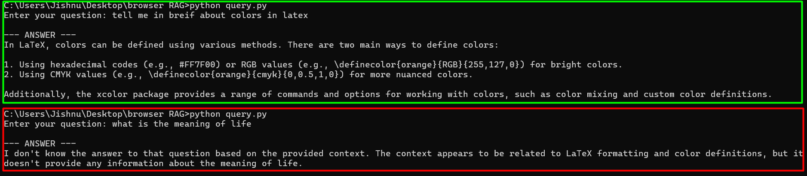

# Browser History RAG

This project automatically fetches your **latest visited websites** from Chrome, Firefox, and Edge on both Windows and Linux, stores them in **ChromaDB**, filters out unwanted domains, downloads and chunks the HTML content, embeds it using **Ollama**'s `nomic-embed-text`, and lets you query the database with **RAG** using LLaMA 3.2.

#### CLI demo



---

## Features

- Extract browsing history from:

  - Google Chrome / Chromium
  - Mozilla Firefox
  - Microsoft Edge

- Cross-platform (Windows & Linux)
- Store history in **ChromaDB** with latest entries on top
- Avoid duplicates via a `last_timestamp.json`
- Skip unwanted domains using `blocked_domains.json`
- Fetch HTML page content, chunk it, and embed into a **content ChromaDB**
- Use **Ollama** for embeddings (`nomic-embed-text`) and RAG queries with LLaMA 3.2
- Local-first and private — no cloud APIs required

---

## Project Structure

```
browser-RAG/
│
├── get_browser_history_store.py   # Main script to fetch history and store in ChromaDB
├── fetch_latest_data.py           # Helper to track new entries and avoid duplicates
├── blocked_domains.json           # List of domains to ignore
├── last_timestamp.json            # Tracks last stored timestamp
├── query.py                       # Query the ChromaDB with RAG using Ollama + LLaMA 3.2
├── requirements.txt               # Dependencies
└── README.md
```

---

## Installation

1. **Clone the repo**

```bash
git clone https://github.com/yourusername/browser-RAG.git
cd browser-RAG
```

2. **Install dependencies**

```bash
pip install -r requirements.txt
```

3. **Install & run Ollama**
   Follow instructions at: [https://ollama.com](https://ollama.com)
   Make sure you have:

```bash
ollama pull nomic-embed-text
ollama pull llama3.2
ollama serve
```

4. **Install Chrome, Firefox, or Edge** (if not already present).

---

## Usage

### 1. Fetch latest browser history

```bash
python get_browser_history_store.py
```

- Reads Chrome, Firefox, and Edge history
- Filters out duplicates and unwanted domains
- Stores URLs and metadata in ChromaDB (`history_collection`)

### 2. Fetch HTML content and embed

_(Done automatically inside the fetch script)_

- Downloads page HTML
- Chunks into smaller sections
- Embeds with `nomic-embed-text`
- Stores in ChromaDB (`content_collection`)

### 3. Query with RAG

```bash
python query.py
```

Example:

```
Enter your query: What was the latest AI article I read?
```

- Retrieves relevant page chunks
- Uses LLaMA 3.2 via Ollama to answer

---

## Configuration

- **Blocked domains**
  Edit `blocked_domains.json`:

```json
["facebook.com", "youtube.com"]
```

- **Last timestamp tracking**
  Stored in `last_timestamp.json`. Do not delete unless you want to re-import all history.

---

## Requirements

- Python 3.10+
- Ollama running locally
- ChromaDB
- Browsers installed with accessible history

---

## Dependencies

```
chromadb
beautifulsoup4
requests
ollama
```

Install via:

```bash
pip install -r requirements.txt
```

---

## Notes

- **Windows**: Browser history files may be locked if the browser is running. Close the browser before running.
- **Linux**: History files are typically in `~/.config/` directories.
- **Ollama**: Ensure it’s running before embedding or querying.

---
