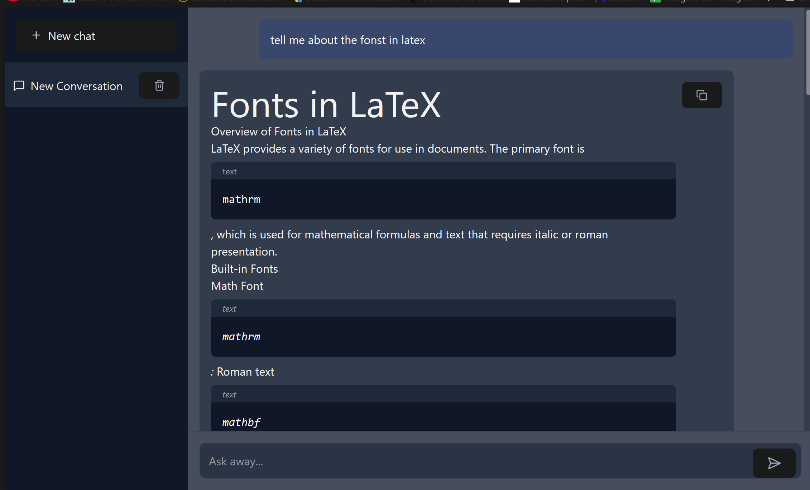

# Browser History RAG

A local-first application that retrieves your browser history, processes the content of visited pages, and allows you to query it using Retrieval-Augmented Generation (RAG) with LLaMA 3.2.


## Features

- **Cross-browser support**: Extracts history from Chrome, Firefox, and Edge on both Windows and Linux
- **Local processing**: All data stays on your machine - no cloud APIs required
- **Content processing**: Downloads, chunks, and embeds HTML content from visited pages
- **Smart filtering**: Blocks unwanted domains and avoids duplicates
- **Powerful querying**: Uses Ollama with LLaMA 3.2 for RAG-based question answering
- **Modern UI**: React-based frontend with conversation history

## Architecture

The application consists of three main components:

1. **Backend** (Python):
   - Fetches browser history
   - Processes and stores content in ChromaDB
   - Provides API endpoints for the frontend
   - Handles RAG queries using Ollama

2. **Frontend** (React + TypeScript):
   - Chat interface with conversation history
   - Markdown rendering with syntax highlighting
   - Responsive design

3. **Database**:
   - ChromaDB for vector storage of page chunks
   - SQLite for conversation history

## Installation

### Prerequisites

- Python 3.10+
- Node.js (for frontend)
- Ollama (running locally)
- Chromium-based browser or Firefox installed

### Backend Setup

1. Clone the repository:
   ```bash
   git clone https://github.com/yourusername/browser-RAG.git
   cd browser-RAG/backend
   ```

2. Install Python dependencies:
   ```bash
   pip install -r requirements.txt
   ```

3. Install Ollama models:
   ```bash
   ollama pull nomic-embed-text
   ollama pull llama3.2
   ollama serve
   ```

### Frontend Setup

1. Navigate to the frontend directory:
   ```bash
   cd ../frontend
   ```

2. Install Node.js dependencies:
   ```bash
   npm install
   ```

## Usage

1. **Start the backend**:
   ```bash
   cd backend
   uvicorn main:app --reload
   ```

2. **Start the frontend**:
   ```bash
   cd frontend
   npm run dev
   ```

3. **Fetch browser history** (in a separate terminal):
   ```bash
   cd backend
   python get_browser_history_store.py
   ```

4. **Process page content**:
   ```bash
   python chunk_and_embedd.py
   ```

5. Access the web interface at `http://localhost:5173`

## Configuration

- **Blocked domains**: Edit `backend/blocked_domains.json`
- **Database paths**: Configured in `backend/chunk_and_embedd.py`
- **Ollama settings**: Adjust model names in `backend/query.py`

## Project Structure

```
browser-RAG/
├── backend/                  # Python backend
│   ├── chunk_and_embedd.py   # Content processing pipeline
│   ├── db.py                 # SQLite database setup
│   ├── fetch_latest_data.py  # History tracking
│   ├── get_browser_history_store.py  # History extraction
│   ├── main.py               # FastAPI server
│   ├── query.py              # RAG query handling
│   └── requirements.txt      # Python dependencies
├── frontend/                 # React frontend
│   ├── public/
│   ├── src/
│   │   ├── Components/       # UI components
│   │   ├── App.tsx           # Main application
│   │   └── main.tsx          # Entry point
│   └── vite.config.ts        # Build configuration
└── README.md                 # This file
```

## Troubleshooting

- Ensure browsers are closed when fetching history
- Verify Ollama is running before querying
- Check console logs for both backend and frontend
